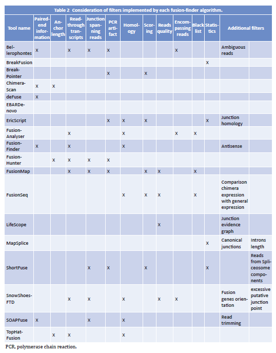

Detection and filtering of fusions with RNA-seq
====================================================

###Software requirements
+ [defuse](http://sourceforge.net/projects/defuse/)
+ [tophat-fusion](http://ccb.jhu.edu/software/tophat/fusion_index.html)
+ [SOAPfuse](http://soap.genomics.org.cn/soapfuse.html)

###Python dependencies 
```bash
pandas
gffutils
pyBigWig
```

###Post-filtering steps

After read mapping and nominating potential fusion candidates a set of filters is applied based on biological and technical indications. 

**Scoring filters**
+ Filter by the number of encompassing and spanning reads (aka supporting reads)

**Technical artefact filters**

| DATABASE                  | DESCRIPTION                 | DATE   | COMMENT |
| :------------------------ |:----------------------------|:-------|:--------|
| [encode](http://hgwdev.cse.ucsc.edu/cgi-bin/hgFileUi?db=hg19&g=wgEncodeMapability) | mapability (50-kmer) | ? | ? |
| [encode_dac](http://hgwdev.cse.ucsc.edu/cgi-bin/hgFileUi?db=hg19&g=wgEncodeMapability) | blacklisted regions | ? | ? |
| [encode_duke](http://hgwdev.cse.ucsc.edu/cgi-bin/hgFileUi?db=hg19&g=wgEncodeMapability) | blacklisted regions | ? | ? |


**Biological filters**

| DATABASE                  | DESCRIPTION                 | DATE   | COMMENT |
| :------------------------ |:----------------------------|:-------|:--------|
| healthy defuse | n = ? healthy granulocytes processed with defuse | ? | ? |
| healthy tophat-fusion | n = ? healthy granulocytes processed with tophat-fusion | ? | ? | 
| healthy soapfuse | n = ? healthy granulocytes processed with soapfuse | ? | ? | 
| [AceView](http://www.ncbi.nlm.nih.gov/IEB/Research/Acembly/index.html?human) database)|  readthrough  |   ?     | ? |
| [ConjoinG database](http://metasystems.riken.jp/conjoing/) | readthrough |  ? | ? |
| [CACG conjoined genes database](http://cgc.kribb.re.kr/map/) | readthrough | ? | ? | 
| NCBI | readthrough | ? |  ? | ? |
| pseudogene - [GENCODE] (http://www.gencodegenes.org/releases/19.html) | ? | ? | ? | 
| non protein coding - [GENCODE] (http://www.gencodegenes.org/releases/19.html) | ? | ? | ? | 


**Annotation**

| DATABASE                  | DESCRIPTION                 | DATE   | COMMENT |
| :------------------------ |:----------------------------|:-------|:--------|
| [TICdb database](http://www.unav.es/genetica/TICdb/) |    |   ?     | ? |
| [Mitelman Database of Chromosome Aberrations in Cancer](http://cgap.nci.nih.gov/Chromosomes/Mitelman.) |    |   ?     | ? |
| [COSMIC database](http://cancer.sanger.ac.uk/cancergenome/projects/cosmic/) |    |   ?     | ? |
| [ChimerDB 2.0 database literature-based annotation](http://ercsb.ewha.ac.kr/FusionGene/) | ? | ? | ? | 


**Additional filters**
+ Removing fusions, which partner genes belong to the same family
+ [Viruses/bacteria/phages genomes database (from the NCBI database)](ftp://ftp.ncbi.nlm.nih.gov/genomes/Viruses/ (required))
+ Evidence from visualization (IGV browser)

Summary table of filters used by fusion detection algorithms.
+ [The structure of state-of-art gene fusion-finder algorithms. M.Becutti, Aug, 2013](https://www.oapublishinglondon.com/article/617)


###What can be improved?

####PROPOSAL 1
#####Motivation/Literature research
+ "Another important group of gene fusions was associated with breakpoints of low-level copy number changes, involving both gains and deletions. These are interesting in the sense that they represent the types of fusion events leading to gene activation with no association with gene amplifications...Fifth, in the vast majority of the fusions (82%), at least one partner gene was located at a copy number breakpoint as revealed by aCGH, indicating that fusion gene formation is closely associated with unbalanced genomic rearrangements, particularly high-level amplifications" [Identification of fusion genes in breast cancer by paired-end RNA-sequencing.](http://genomebiology.com/content/12/1/R6)

+ [Identification of somatically acquired rearrangements in cancer using genome-wide massively parallel paired-end sequencing.](http://www.nature.com/ng/journal/v40/n6/fig_tab/ng.128_F3.html)


#####Idea
+ Can we use public data/database on germline structural variant calls to filter for gene fusions
  + Most biological database filter for gene IDs (only some databases offer breakpoint positions as well, but most don't)
  + SNP arrays have far too low resolution, CNV information from WGS data could potentially be beneficial for this approach

####PROPOSAL 2
+ Detection and filtering of fusions is followed by manually looking at the sequence and blasting the fusion junction to the reference genome. Very often these sequences fall within repetitive sequences, or the 5' and 3' region of the fusion is very similar

#####Idea
  + Implement a repetitive sequence filter
    + UCSC Mappability Track, Repeat Masker Tracks 
    + [Duke Exclude Regions](http://hgdownload.cse.ucsc.edu/goldenPath/hg18/encodeDCC/wgEncodeMapability/) 
    + [DAC Blacklisted Regions](http://hgwdev.cse.ucsc.edu/cgi-bin/hgFileUi?db=hg19&g=wgEncodeMapability)
    + [1000 Genomes Masks](http://www.1000genomes.org/announcements/genome-accessibility-information-now-available-1000-genomes-browser-2012-09-06)
  + Implement a 5' 3' homology filter
  + [sequence similarity search](http://www.ebi.ac.uk/Tools/sss/)


